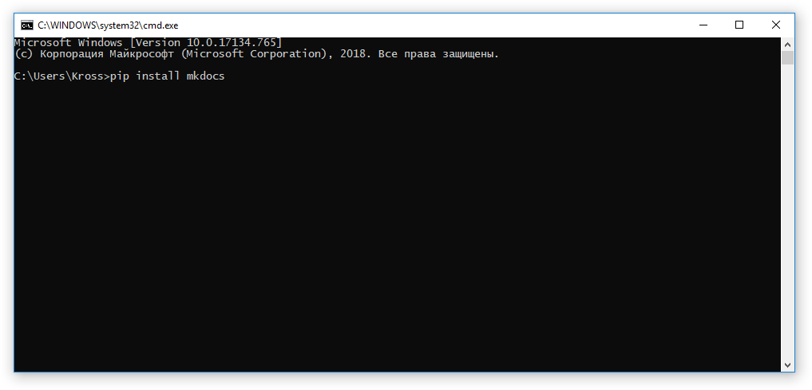
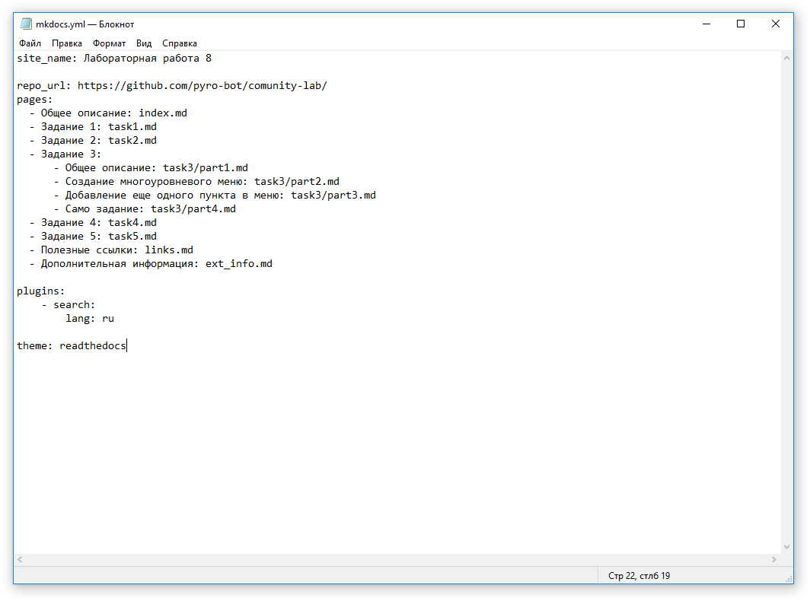
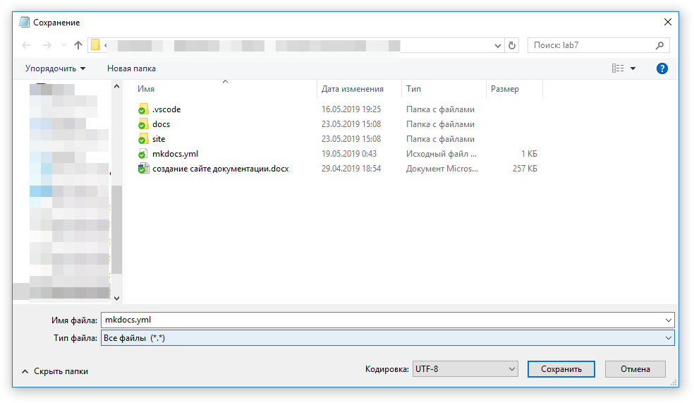

## Как установить mkdocs в Python
Щаги:

1. [Установите Python](links.md#python)
2. Откройте консоль (нажмите Win+R) и введите в окне `cmd`

3. Нажмите *ОК*
4. У вас откроется черное окно называемое командной строкой
5. В ней нужно ввести команду `pip install mkdocs`

6. Нажать *Enter*
7. После чего у вас запустится процесс установки библиотеки *mkdocs*
8. Дождитесь его завершения
9. После установки вы можите создать свой проект

## Создание проекта с сайтом

1. Создайте пустую папку
2. Скачайте туда файл [init.bat](media/init.bat) *Если файл открывается браузером, но не скачивается, то просто нажмите на ссылке ПКМ -> Сохранить ссылку как*
2. Запустите файл *init.bat*. После чего у вас появится папку `static_site`. Это папка вашего проекта
3. Скачайте файл [serve.bat](media/serve.bat) и положите его в папку `static_site`.
4. Запустите файл `serve.bat`
5. После этого можите открыть ваш сайт [localhost:8000](http://localhost:8000)

## Сборка сайта для GitHub Pages

1. Скачайте файл [build.bat](media/build.bat). И положите его рядом с файлом `serve.bat`
2. Запустите файл `build.bat`
3. У вас появится папка `site`
4. Содержимое папки `site` надо загрузить в GitHub

## Команды для работы с mkdocs

* `mkdocs new [dir-name]` - Создать новый проект
* `mkdocs serve` - Запустить сервер для просмотра вашего сайта
* `mkdocs build` - Собрать сайт
* `mkdocs help` - Получить справку

## Работа в блокноте

Запомните: все файлы можно открыть в блокноте  
Однако при работе с файлами в блокноте и с русским языком у вас могут возникнуть проблемы,  
так что давайте научимся редактировать файлы правильно

1. Первым делом откроте нужный вам файл в блокноте *Для примера откроем файл конфигураций нашего сайта*  
  
Как можно видеть в данном файле много русских  слов, однако просто так взять и сохранить данный файл нельзя иначе у вас будет проблема с кодировкой символов.  
Правильное сохранение файла - это сохранение файла в кодировке UTF-8 (Юникод).
2. Далее выберите в меню `Файл` пункт `Сохранить как`
3. Первым делом в типе файла выберите `Все файлы`
3. В кодировке выберите `UTF-8`
4. Убедитесь, что имя файла написано правильно
5. Теперь можно сохранить файл

