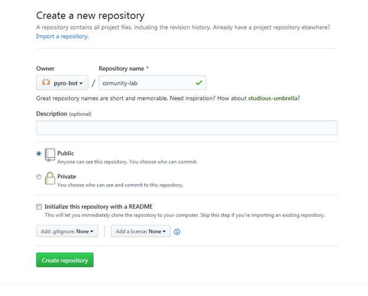
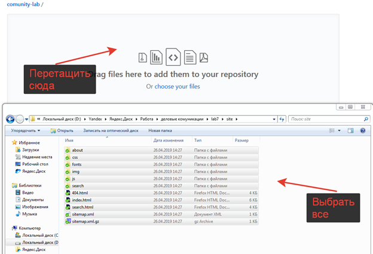
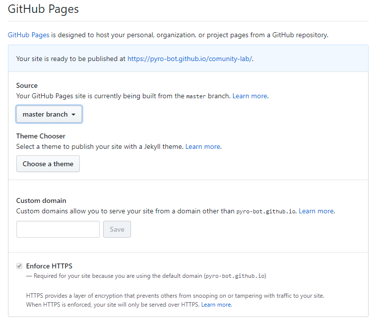

# Публикация сайта

В данном задании мы научимся публиковать наш сайт в интернете.

## Github Pages

Github Pages - это сервис позволяющий публиковать свои статические сайты в интернете на базе Github

## Процесс публикации
1. Сгенерировать сайт для публикации
2. Создать репозиторий
3. Загрузить файлы сайта
4. Настроить Github Pages

### 1. Генерация сайта для публикации
1. Найдите и запустите файл `build.bat` или `vdocs-build.bat`
2. В результате работы файла у вас появится папка `site`
3. Это и есть ваш сайт. Загружать нужно содержимое этой папки

### 2. Создание репозитория
1. Первым делом надо зарегистрироваться на сайте [github.com](https://github.com/)
2. Создать репозиторий, нажав на кнопку `New` на главной странице github.com 
3. Настройте свой репозиторий: 
    - поле `Repository Name` - имя вашего репозитория. **Только на английском и без пробелов**
Другие параметры трогать не надо.  
В конце нажмите на кнопку `Create repository`  
После создания репозитория вы увидите стартовую страницу вашего нового репозитория  
*Стоит отметить, что как только вы загрузите файлы данная страница пропадет, но это не страшно, так как в новом интерфейсе ее функции дублируются*

### 3. Загрузка файлов
Существует 2 сценария загрузки файлов:

- Для первой загрузки файлов
- Для всех последующих

Мы разберем оба

#### Загрузка файлов в первый раз
1. Как только вы создадите репозиторий вы увидете стартовую страницу

2. Нажмите на ней ссылку `uploading an existing file` *Выделено красной стрелкой*  
3. После этого вы увидите страницу для загрузки файлов

4. Откройте папку с файлами сайта и просто перетащите их в поле для загрузки на сайте
5. После того как все файлы будут загружены нажмите на кнопку `Commit changes` *Загрузка файлов после перетаскивания начнется автоматически*

6. После фиксации изменений `Commit changes` вы увидете страницу вашего репозитория с вашими файлами

#### Загрузка файлов в репозиторий с уже существующими файлами
1. Для загрузки файлов поспользуйтесь кнопкой `Upload files` на главной странице вашего репозитория
2. Далее все как в *Загрузка файлов в первый раз*, начиная с *шага 3*

## 4. Настроить Github Pages 
1. На влавной странице вашего репозитория нажмите кнопку `Settings`
2. Промотайте страницу настроек до надписи `GitHub Pages`

3. Настройте блок согласно рисунку выше
4. После настройки вы увидите надпись вверху блока `GitHub Pages` - `Your site is ready to be published at <адрес сайта>`  
Если эта надпись появилась, то это значит, что ваш сайт готовится к публикации  
Когда публикация будет завершена вы увидите следующую надпись `Your site is published at <адрес сайта>` *Зеленого цвета*

## Описание задания
Опубликовать ваш сайт на Github Pages